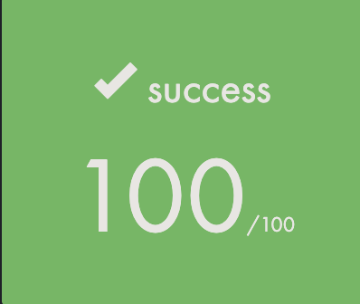

# CPP-Module
This repository is for CPP programming language learning exercises. Excellent course given by Guillaume Revyin.
Introduction, Constructors, Destructors and memory, friend and inheritance, overload and polymorphism, Multiple inheritance, STL, Containers and Iterators, Abstract types and templates and Exceptions.
# My Comment
In this project, I was introduced to OOP for the first time and learned cpp and general exercises. I learned a lot and it was a nice project. Each cpp folder is considered as a project and there are different programs in each exercise folder in them. Thank you FT.

## [ CPP 00 ](https://github.com/makbulut42/CPP-Module/tree/main/cpp00) 
### This first module of C++ is designed to help you understand the features of the language compared to C. Time to dive into object-oriented programming!

## [ CPP 01 ](https://github.com/makbulut42/CPP-Module/tree/main/cpp01)
### This module is designed to help you understand memory allocation, reference, pointers to members, and use of the switch in CPP. 

## [ CPP 02 ](https://github.com/makbulut42/CPP-Module/tree/main/cpp02)
### This module is designed to help you understand Ad-hoc polymorphism, overloads, and orthodox canonical classes in CPP. 

## [ CPP 03 ](https://github.com/makbulut42/CPP-Module/tree/main/cpp03)
### This module is designed to help you understand Inheritance in CPP.

## [ CPP 04 ](https://github.com/makbulut42/CPP-Module/tree/main/cpp04)
### This module is designed to help you understand Subtype polymorphism, abstract classes and interfaces in CPP.

## [ CPP 05 ](https://github.com/makbulut42/CPP-Module/tree/main/cpp05)
### This module is designed to help you understand Try/Catch and Exceptions in CPP.

## [ CPP 06 ](https://github.com/makbulut42/CPP-Module/tree/main/cpp06)
### This module is designed to help you understand the different casts in CPP.

## [ CPP 07 ](https://github.com/makbulut42/CPP-Module/tree/main/cpp07)
### This module is designed to help you understand Templates in CPP.

## [ CPP 08 ](https://github.com/makbulut42/CPP-Module/tree/main/cpp08)
### This module is designed to help you understand templated containers, iterators and algorithms in CPP.

